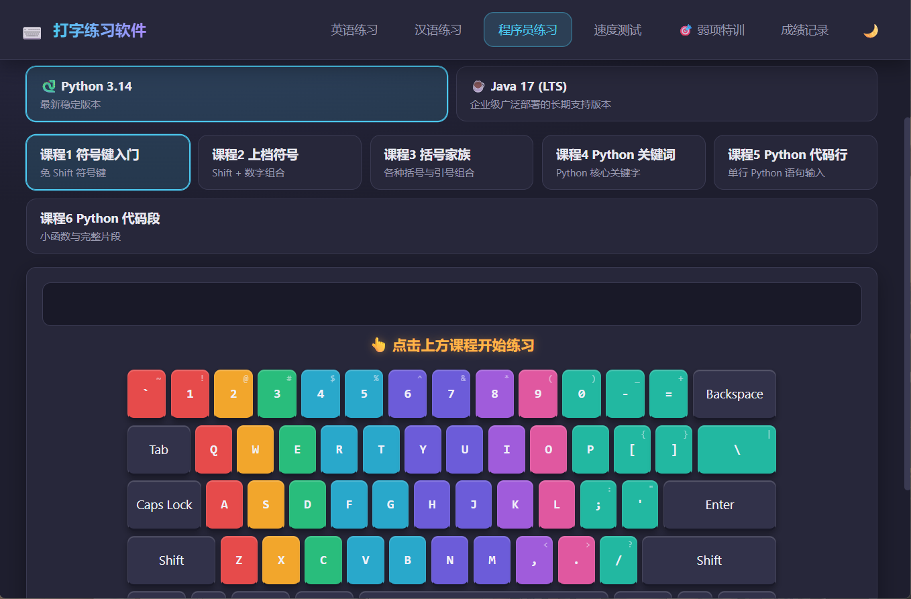

# ⌨️ TypeFlow · 打字练习软件


一款**完全离线、本地运行**的 Windows 桌面打字练习软件，帮你循序渐进掌握标准键位指法，量化提升打字速度与准确率。

> 支持 **英文指法 · 拼音 · 五笔 · 程序员 · 速度测试 · 代码速度测试 · 弱项特训 · 成绩记录** 八大板块。

---

## ✨ 功能特性

| 板块 | 说明 |
|------|------|
| ⌨️ **英文指法练习** | 7 课渐进课程（基准键 → 全键 + 大小写），真实 QWERTY 键盘可视化 + 指法配色 + Shift 高亮 |
| 🅿️ **拼音练习** | 6 课渐进（音节 → 单字 → 词语 → 短句 → 综合），支持系统输入法（IME）逐字输入 |
| 🔤 **五笔练习** | 6 课渐进（一级简码 → 键名字 → 高频字 → 词组 → 文章）+ 五笔86编码逐码对比（内置 400+ 常用字字典） |
| 💻 **程序员练习** | 6 课渐进（符号 → 上档 → 括号 → 关键词 → 代码行 → 代码段），支持 **Python / Java** 切换 + Shift 符号映射高亮 |
| 🚀 **速度测试** | 中英双板块：**100 篇英文** + **100 篇中文**（含《洛神赋》挑战级），逐字符高亮、实时 WPM/CPM、退格回退 |
| 💻 **代码速度测试** | **20 段真实代码**（Python + Java），同一任务用**新手 / 老手**两种风格书写，练习输入真实代码并感受风格差异 |
| 🎯 **弱项特训** | 自动分析历史成绩，生成针对高频错误字符的专项练习 + 错误上下文示例 + 可删除/恢复弱项 |
| 📊 **成绩记录** | 多种类型识别 + 筛选 + SVG 进步曲线 + 逐字符错误回放 + 删除/清空 |
| 🌙 **主题切换** | 深色 / 浅色一键切换，偏好自动保存 |

---

## 🖼️ 界面预览

**英文指法练习**：标准键位指法渐进课程（基准键 → 全键 + 大小写）+ 真实 QWERTY 键盘可视化。


**程序员练习**：Python / Java 切换，符号 → 代码段渐进课程。



**速度测试**：英文 / 中文 / 代码三板块测速，逐字符高亮。


---

## 🚀 安装步骤

> 安装包不放入 Git 仓库（单个文件约 103~110MB，超过 GitHub 100MB 单文件限制），
> 由 CI 自动构建后统一发布在 **GitHub Releases** 页面：
> 👉 <https://github.com/ane-typing/TypeFlow/releases>
>
> 点开最新版本的 `Assets` 即可看到两个安装文件，版本号以 Releases 页面为准。

### 方式一：安装版（推荐）
1. 在 Releases 页面下载安装包 `Setup.<版本号>.exe`（安装版，约 103MB）。
2. 双击运行安装程序。
3. 按向导选择安装目录（默认即可），可勾选「创建桌面快捷方式」。
4. 点击「完成」，桌面会出现「打字练习软件」快捷方式，双击即可启动。

### 方式二：便携版（免安装）
1. 在 Releases 页面下载便携版 `<版本号>.exe`（约 110MB）。
2. 双击即可直接运行，无需安装；也可复制到任意目录或 U 盘随身携带。

### 系统要求
- Windows 10 / 11（x64）
- 完全离线运行，无需联网

---

## 🕹️ 使用步骤

1. **启动软件**：按上述安装方式启动后，进入主界面，顶部为导航栏。
2. **选择板块**：点击导航栏进入对应练习——
   - `英语练习`：英文指法渐进课程；
   - `汉语练习`：拼音 / 五笔两种输入法练习；
   - `程序员练习`：Python / Java 代码指法；
   - `速度测试`：选择英文、中文或代码文章进行测速；
   - `弱项特训`：自动分析你的错误，针对性练习；
   - `成绩记录`：查看历史成绩与进步曲线。
3. **开始练习**：点击课程/文章卡片，按提示在键盘上输入目标内容，实时显示速度、准确率与进度。
4. **查看成绩**：练习完成后成绩自动保存到「成绩记录」，可在其中查看、筛选、分析错误，或删除/清空。
5. **切换主题**：点击导航栏右侧的 🌙/☀️ 按钮，在深色与浅色之间切换，偏好自动保存。

---

## 🛠️ 技术栈

- **框架**：[Electron](https://www.electronjs.org/)（主进程 + 渲染进程，安全隔离）
- **前端**：原生 HTML / CSS / JavaScript（无框架，见名知意）
- **存储**：本地 JSON 文件（`%APPDATA%/打字练习软件/records.json`）
- **打包**：electron-builder（NSIS 安装版 + portable 便携版，一次构建产出两个 exe）

### 安全设计
- `contextIsolation: true` + `nodeIntegration: false`
- 渲染进程仅通过 `preload` 暴露的 `window.api` 访问主进程能力
- 成绩数据写入 Electron 用户数据目录，避免打包后写入只读区导致丢失

---

## 🔧 开发 & 打包

```bash
# 安装依赖（Electron 二进制建议使用 npmmirror 镜像）
npm install

# 开发模式运行
npm start

# 打包 Windows 安装版 + 便携版（输出到 dist/，含两个 exe）
npm run build

# 只打包便携版（单文件 exe）
npm run build:portable
```

> 本地构建产物（`dist/`）不会提交到仓库，正式安装包由 GitHub Actions 在打 `v*` tag 时自动构建并挂到 Releases。

> 打包遇到 GitHub 下载超时时，可设置国内镜像后重试：
> ```
> set ELECTRON_MIRROR=https://npmmirror.com/mirrors/electron/
> set ELECTRON_BUILDER_BINARIES_MIRROR=https://npmmirror.com/mirrors/electron-builder-binaries/
> ```

---

## 📁 项目结构

```
TypeFlow/
├── backend/          # Electron 主进程（窗口、IPC、数据持久化）
├── frontend/         # 前端页面与逻辑（index.html / css / js / en / zh / code）
├── test/             # 数据校验与回归脚本
├── e2e-tests/        # Electron 端到端回归套件
├── .github/          # GitHub Actions 自动打包与发布工作流
├── CONTRIBUTING.md   # 贡献指南
├── SECURITY.md       # 安全政策
├── CODE_OF_CONDUCT.md # 行为准则
├── package.json      # 项目配置与打包脚本
└── README.md         # 项目说明
```

---

## 🤝 贡献

欢迎提交 Issue 和 Pull Request！请先阅读 [贡献指南](CONTRIBUTING.md)。

- 报告安全漏洞请见 [安全政策](SECURITY.md)
- 社区行为规范见 [行为准则](CODE_OF_CONDUCT.md)

---

## 📜 许可证

本项目基于 **MIT License** 开源。

---

*作者：AnE Liu ｜ 版本 v0.2.0*

